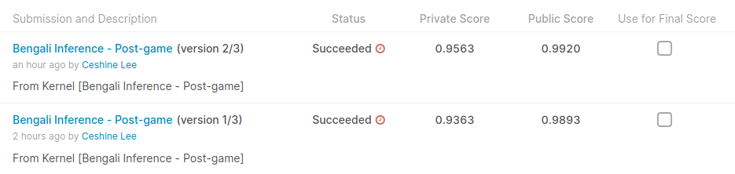

# TPU-Ready TF 2.1 Solution to Bengali.AI Handwritten Grapheme Classification

A rather generic image classification pipeline with TPU-compatible MixUp and CutMix implementations.

(This is the preliminary documentation. Please create an issue if you have any specific questions.)

## Preparation

Install Tensorflow >= 2.1 and run `pip install tf-helper-bot/.`.

### Build the wheels

`python setup.py sdist bdist_wheel`

And upload the `.whl` files in the `dist` directory to Google Cloud Storage.

#### Create the TFRecord files

Create data splits:

`python scripts/split_train.py`

Prepare TFRecord files (the following only prepares the data for one fold):

`python -m bengali.prepare_tfrecords data/train_split_0.csv data/tfrecords/train_0/`

`python -m bengali.prepare_tfrecords data/valid_split_0.csv data/tfrecords/valid_0/`

Upload the content in `data/tfrecords` to Google Cloud Storage:

(Note: check [requirements.txt](requirements.txt) for missing dependencies.)

## Training

Example command:

```bash
python -m bengali.train --batch-size 64 --arch b4 --checkpoint-interval 2000 --steps 20010 --train-folder "gs://ceshine-tpu-us-central/bengali/train_0/*" --valid-folder "gs://ceshine-tpu-us-central/bengali/valid_0/*" --resize 192,330 --max-lr 4e-3 --mixup-alpha -1 --cutmix-alpha 1. --weight-decay 0 --log-interval 500 --mixed-precision --output-suffix _192330_0 --radam
```

## Inference

Example command:

```bash
python -m bengali.inference --model-paths \
    ../input/bengalimodels/b5_192230_9966_0790_0_radam.h5,../input/bengalimodels/b5_192230_9960_0834_6.h5,\
    ../input/bengalimodels/b4g_192230_9961_0840_0_noisy_ranger.h5,../input/bengalimodels/b4g_192230_9962_0846_0_noisy.h5 \
    --batch-size 64 --parquet-pattern "data/test_image_data_*.parquet" --resize 192,330 --method arithmetic
```

### Post-process the Predictions

[For more details, please refer to this excellent write-up by Chris Deotte](https://www.kaggle.com/c/bengaliai-cv19/discussion/136021).

Simply set the `--reweight` flag in the inference command. Here's what happens after you do it:



This boost the ensemble model from 73th place to 6th place in the private learder board. Too bad I did not think of it during the competition.
